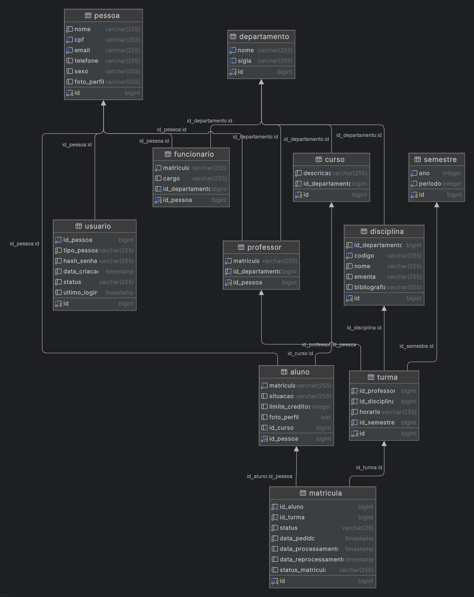

# Uniesquina

Projeto final da disciplina **INF0257 - Introdução à Programação**, desenvolvido durante o programa de Residência em TI do TJGO/UFG com o objetivo de consolidar conhecimentos de Orientação a Objetos e boas práticas de desenvolvimento full-stack.

## Apresentação

<a href="https://www.youtube.com/watch?v=_HPfYZQFWcE" target="_blank">
  
</a>

## Objetivos do Projeto

O sistema simula uma plataforma acadêmica universitária com três perfis de usuários:

- Aluno
- Professor
- Funcionário Administrativo

A proposta é aplicar de forma prática os 4 pilares da Orientação a Objetos:
- Abstração
- Encapsulamento
- Herança
- Polimorfismo

Além disso, foram incorporados conceitos de *Design Patterns* como *Strategy* e *Repository Pattern*, bem como práticas modernas de containerização com Docker.

## Modelagem do Banco de Dados

Abaixo, a modelagem atual do banco de dados utilizada no projeto:



## Tecnologias Utilizadas

### Backend
- Java 21
- Spring Boot
- Spring Security + JWT
- JPA / Hibernate
- PostgreSQL
- Docker / Docker Compose

### Frontend
- Angular 17
- Bootstrap + SCSS
- ngx-toastr, ng-bootstrap e outros

### DevOps
- Docker
- Volumes persistentes (PostgreSQL)
- Build e deploy multi-stage (frontend)

## Como Executar Localmente

### Pré-requisitos
- Docker
- Docker Compose

### Passos

```bash
# Clone o repositório
git clone https://github.com/seu-usuario/uniesquina.git
cd uniesquina

# Suba os containers
docker-compose up --build
